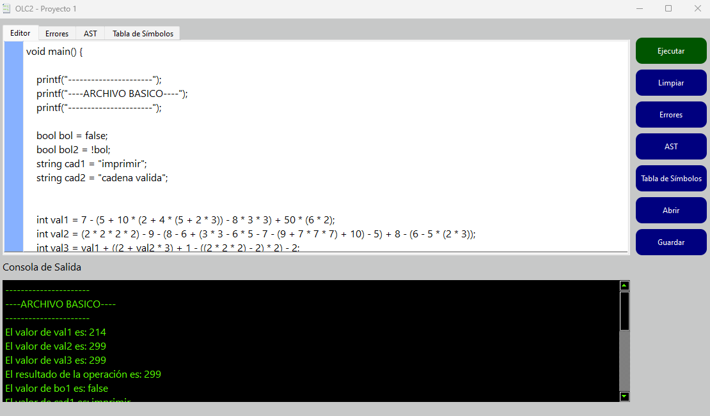
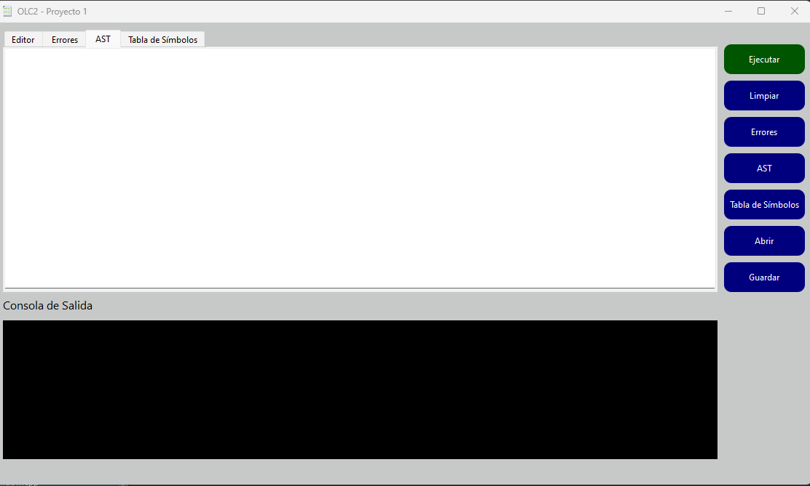

>
>
>Universidad San Carlos de Guatemala
>
>Facultad de Ingeniería 
>
>Escuela de Ciencias y Sistemas 
>
>Primer Semestre, 2023
>
>Laboratorio de Organización de Lenguajes y Compiladores 2 - Sección N 

# Proyecto 2 - mini OLC
### v1.2

| Nombre                               | Carnet    |
| ------------------------------------ | --------- |
|   &nbsp; Melyza Alejandra Rodríguez Contreras | 201314821 |

<div id='content'/>

## Contenido

1. [Manual técnico](#id1)
-  [Herramientas utilizadas  ](#id2)
-  [Arquitectura de la solución](#id3)
-  [Definición de tokens y gramática](#id4)
-  [Clases abstractas](#id5)
-  [Manejo de entornos](#id6)
-  [Diccionario de expresiones](#id7)
-  [Diccionario de instrucciones](#id8)
-  [Manejo de errores](#id9)
-  [Generación de reportes GRAPHVIZ](#id10)

2. [Manual de usuario](#id20)


- [Ingreso a la aplicación](#id22)
- [Opciones](#id21)
- [Editor](#id23)
- [Consola ](#id24)
- [Fuente de entrada](#id25)
- [Ejecutar análisis](#id26)
- [Resultados de la ejecución](#id27)
- [Reportes](#id28)
- [Nuevo análisis](#id29)

<div id='id1'/>

## 1. Manual Técnico  [ ⇧](#content)

<div id='id2'/>

- **Herramientas utilizadas**[ ⇧](#content)

|Herramienta|Descripción|
|--|--|
|**IDE**| <br>QTCreator<br>Versión 9.0.1  |
|**Análisis Sintáctico**|Flex<br>Versión 2.6.4 |
|**Análisis Léxico**|BISON<br>GNU Bison <br>Versión 3.7.4 |
|**Sistema operativo**|<br>Windows 11 22H2|
|**Editor de texto**|<br>Visual Studio Code<br>Versión 1.76.2|

<div id='id3'/>

- **Arquitectura de la solución**[ ⇧](#content)


<div id='id4'/>

- **Definición de tokens y gramática**[ ⇧](#content)

**Definición de tokens**
```sh
ID                              ([a-zA-Z\_]+[0-9a-zA-Z\_]*)
TIPO_INTEGER                    [0-9]+
TIPO_FLOAT                      [0-9]+"."[0-9]+
TIPO_STRING                     \"(\\.|[^"\\])*\"
TIPO_BOOL_TRUE                  "true"
TIPO_BOOL_FALSE                 "false"
"//"[^\n]*\n                                ;   /* COMENTARIO DE UNA LINEA */
"/*"[^CIERRE_COMENTARIO_MULTILINEA]*"*/"    ;   /* COMENTARIO DE MULTI-LINEA */
[ \t\v\r\n\f]                               ;   /* ESPACIOS Y CARACTERES EN BLANCO */
"{"                     return Parser::symbol_type( token::LLAVEABRE,           loc );
"}"                     return Parser::symbol_type( token::LLAVECIERRA,         loc );
"int"                   return Parser::symbol_type( token::RINT,                loc );
"float"                 return Parser::symbol_type( token::RFLOAT,              loc );
"string"                return Parser::symbol_type( token::RSTRING,             loc );
"bool"                  return Parser::symbol_type( token::RBOOL,               loc );
"printf"                return Parser::symbol_type( token::RPRINTF,             loc );
"="                     return Parser::symbol_type( token::IGUAL,               loc );
"+"                     return Parser::symbol_type( token::OPSUMA,              loc );
"-"                     return Parser::symbol_type( token::OPRESTA,             loc );
"*"                     return Parser::symbol_type( token::OPMULTIPLICACION,    loc );
"/"                     return Parser::symbol_type( token::OPDIVISION,          loc );
"%"                     return Parser::symbol_type( token::OPMODULO,            loc );
"("                     return Parser::symbol_type( token::PARABRE,             loc );
")"                     return Parser::symbol_type( token::PARCIERRA,           loc );
";"                     return Parser::symbol_type( token::PTCOMA,              loc );
"!="                    return Parser::symbol_type( token::NOIGUAL,             loc );
">"                     return Parser::symbol_type( token::MAYOR,               loc );
"<"                     return Parser::symbol_type( token::MENOR,               loc );
"if"                    return Parser::symbol_type( token::R_IF,                loc );
"else"                  return Parser::symbol_type( token::R_ELSE,              loc );
"main"                  return Parser::symbol_type( token::R_MAIN,              loc );
"void"                  return Parser::symbol_type( token::RVOID,               loc );
"&&"                    return Parser::symbol_type( token::RAND,                loc );
"||"                    return Parser::symbol_type( token::ROR,                 loc );
"!"                     return Parser::symbol_type( token::NOT,                 loc );
"while"                 return Parser::symbol_type( token::RWHILE,              loc );
"for"                   return Parser::symbol_type( token::RFOR,                loc );
"break"                 return Parser::symbol_type( token::RBREAK,              loc );
"continue"              return Parser::symbol_type( token::RCONTINUE,           loc );
"++"                    return Parser::symbol_type( token::MASMAS,              loc );
"atoi"                  return Parser::symbol_type( token::RATOI,               loc );
"atof"                  return Parser::symbol_type( token::RATOF,               loc );
"iota"                  return Parser::symbol_type( token::RIOTA,               loc );
","                     return Parser::symbol_type( token::COMA,                loc );
"struct"                return Parser::symbol_type( token::RSTRUCT,             loc );
"."                     return Parser::symbol_type( token::PUNTO,               loc );
"vector"                return Parser::symbol_type( token::RVECTOR,             loc );
"["                     return Parser::symbol_type( token::CORABRE,             loc );
"]"                     return Parser::symbol_type( token::CORCIERRA,           loc );
"get"                   return Parser::symbol_type( token::RGET,                loc );
"size"                  return Parser::symbol_type( token::RSIZE,               loc );
"push_back"             return Parser::symbol_type( token::RPUSHBACK,           loc );
{TIPO_INTEGER}          return Parser::make_TIPO_INTEGER(yytext,                loc );
{TIPO_FLOAT}            return Parser::make_TIPO_FLOAT  (yytext,                loc );
{TIPO_STRING}           return Parser::make_TIPO_STRING (yytext,                loc );
{TIPO_BOOL_TRUE}        return Parser::make_TIPO_BOOL_TRUE(yytext,              loc );
{TIPO_BOOL_FALSE}       return Parser::make_TIPO_BOOL_FALSE(yytext,             loc );
{ID}                    return Parser::make_ID( yytext,                         loc );

```
> \* ***Nota:*** Cualquier ocurrencia de un caracter no especificado en esta sección fue tomado como error de tipo **léxico**.

**Gramática**
```sh
inicio : s 

s :   s  contenido    
    | contenido      
    
contenido   :   func_main    

func_main   :   tipo_main R_MAIN PARABRE PARCIERRA LLAVEABRE instrucciones  LLAVECIERRA     

tipo_main   :   RINT        
            |   RVOID      

instrucciones :     instrucciones instruccion       
                |   instruccion                     

instruccion :       declaracion                    
                |   func_printf PTCOMA              
                |   incremento_instruccion PTCOMA 
                |   asignacion PTCOMA               
                |   declaracion_sin_valor PTCOMA   
                |   instruccion_if                 
                |   instruccion_while               
                |   instruccion_for                 
                |   dec_struct                      
                |   creation_struct                 
                |   declaracion_arreglo             
                |   instrucciones_vector            


instrucciones_vector    :   ID PUNTO RPUSHBACK PARABRE expresion PARCIERRA PTCOMA  


declaracion_arreglo :   RVECTOR MENOR tipo MAYOR ID PTCOMA      
                    |   RVECTOR MENOR tipo MAYOR ID IGUAL CORABRE lista_expresiones_printf CORCIERRA PTCOMA 

dec_struct      :   RSTRUCT ID LLAVEABRE dec_list LLAVECIERRA   


dec_list    :   dec_list tipo ID PTCOMA     
            |   tipo ID PTCOMA              

creation_struct :  RSTRUCT ID ID IGUAL LLAVEABRE lista_expresiones_printf LLAVECIERRA PTCOMA    

declaracion :   tipo ID IGUAL expresion PTCOMA      
            |   tipo ID IGUAL expresion error '\n' 


tipo :      RINT        
        |   RFLOAT     
        |   RSTRING    
        |   RBOOL       

expresion :     expresion OPSUMA expresion                  
            |   expresion OPRESTA expresion                
            |   expresion OPMULTIPLICACION expresion        
            |   expresion OPDIVISION expresion              
            |   expresion OPMODULO expresion               
            |   expresion IGUAL IGUAL expresion             
            |   expresion NOIGUAL expresion                 
            |   expresion MAYOR expresion                   
            |   expresion MENOR expresion                  
            |   expresion MAYOR IGUAL expresion             
            |   expresion MENOR IGUAL expresion             
            |   expresion RAND expresion                    
            |   expresion ROR expresion                     
            |   NOT expresion                               
            |   MASMAS ID                                   
            |   ID  MASMAS                                  
            |   PARABRE   expresion PARCIERRA               
            |   OPRESTA expresion                          
            |   RATOI PARABRE expresion PARCIERRA       
            |   RATOF PARABRE expresion PARCIERRA           
            |   RIOTA PARABRE expresion PARCIERRA           
            |   op_vector                                  
            |   primitivo                                   
            

primitivo :     TIPO_INTEGER                  
            |   TIPO_STRING             
            |   TIPO_FLOAT            
            |   TIPO_BOOL_TRUE       
            |   TIPO_BOOL_FALSE      
            |   llamada_variable     


op_vector   :   ID CORABRE expresion CORCIERRA            
            |   ID PUNTO RGET PARABRE expresion PARCIERRA   
            |   ID PUNTO RSIZE PARABRE PARCIERRA            

llamada_variable    :   ID       

func_printf :   RPRINTF PARABRE lista_expresiones_printf PARCIERRA 


lista_expresiones_printf    :   lista_expresiones_printf COMA expresion            
                            |   expresion                                      


incremento_instruccion  :   ID MASMAS                    
                        |   MASMAS ID                


asignacion :    ID IGUAL expresion                              

declaracion_sin_valor    :  tipo ID                            

instruccion_if  :   R_IF PARABRE expresion PARCIERRA LLAVEABRE cuerpo_if LLAVECIERRA list_elseif list_else 
                |   R_IF PARABRE expresion PARCIERRA LLAVEABRE cuerpo_if LLAVECIERRA list_elseif            
                |   R_IF PARABRE expresion PARCIERRA LLAVEABRE cuerpo_if LLAVECIERRA list_else             
                |   R_IF PARABRE expresion PARCIERRA LLAVEABRE cuerpo_if LLAVECIERRA                       


cuerpo_if   :   cuerpo_if instruccion_if_cuerpo    
            |   instruccion_if_cuerpo             

instruccion_if_cuerpo   :   declaracion PTCOMA           
                        |   func_printf PTCOMA            
                        |   incremento_instruccion PTCOMA   
                        |   asignacion PTCOMA               
                        |   declaracion_sin_valor PTCOMA    
                        |   instruccion_if                  
                        |   instruccion_while               
                        |   instruccion_for                 
                        |   dec_struct                      
                        |   creation_struct                

list_elseif :   list_elseif R_ELSE R_IF PARABRE expresion PARCIERRA LLAVEABRE cuerpo_if LLAVECIERRA     
            |   R_ELSE R_IF PARABRE expresion PARCIERRA  LLAVEABRE cuerpo_if LLAVECIERRA               


list_else   :   R_ELSE LLAVEABRE cuerpo_if LLAVECIERRA                                              


instruccion_while   :   RWHILE PARABRE expresion PARCIERRA LLAVEABRE cuerpo_while LLAVECIERRA               {

cuerpo_while    :   cuerpo_while instruccion_while_cuerpo       
                |   instruccion_while_cuerpo                    


instruccion_while_cuerpo    :   func_printf PTCOMA                 
                            |   instruccion_for                 
                            |   instruccion_if                 
                            |   incremento_instruccion PTCOMA 
                            |   asignacion PTCOMA                  
                            |   RBREAK PTCOMA                      
                            |   RCONTINUE PTCOMA                  
                            |   instruccion_while               
                            |   declaracion PTCOMA                
                            |   declaracion_sin_valor PTCOMA       


instruccion_for :   RFOR PARABRE declaracion_for PTCOMA expresion PTCOMA incremento_for PARCIERRA LLAVEABRE cuerpo_for LLAVECIERRA 

declaracion_for :   declaracion             
                |   asignacion              
                |   declaracion_sin_valor 


incremento_for  :   asignacion
                |   incremento_instruccion           


cuerpo_for      :   cuerpo_for instruccion_for_cuerpo    
                |   instruccion_for_cuerpo             


instruccion_for_cuerpo  :   func_printf PTCOMA               
                        |   incremento_instruccion PTCOMA       
                        |   asignacion PTCOMA         
                        
                        
```
> \* ***Nota:*** Cualquier ocurrencia de una combinación de tokens no especificada en esta sección fue tomada como un error de tipo **sintáctico**.


<div id='id6'/>

- **Manejo de entornos**[ ⇧](#content)

Para llevar a cabo el manejo de entornos y símbolos pertenecientes a los mismos, se creó la clase ***environment***, la cual se detalla a continuación.

**Atributos**

|Atributo|Tipo |Descripción|
|--|--|--|
|Padre|* *environment*|Apuntador al entorno padre, es decir al entorno que está en un nivel superior. En el caso del entorno global, este atributo apunta a *nullptr*.|
|string|*id*|Nombre que representa al entorno, se utiliza para identificar al entorno en los reportes y así determinar errores con mayor facilidad.|
|map<std::string, map<std::string, TipoDato>>|*TablaStructs*|Estructura que almacena los *structs* declarados en el entorno.|
|map<std::string,map<TipoDato,QVector<symbol>>>|*TablaArray*|Estructura que almacena los *vectores* declarados en el entorno.|

**Métodos**

|Método|Tipo |Descripción|
|--|--|--|
|SaveVariable|*void*|Guarda variables en el entorno actual.|
|ModificarVariable|*void*|Modifica el valor de una variable en el entorno actual o en un entorno superior.|
|GetVariable|*symbol*|Retorna el valor de la varibale, consulta en el entorno actual o en un entorno superior.|
|IncrementarVariable|*void*|Incrementa en 1 [+1] el valor de una varible perteneciente al entorno actual o a un entorno superior.|
|SaveStruct|*void*|Almacena un  struct en el entorno actual.|
|GetStruct|* map<std::string, TipoDato>*|Retorna la lista de valores declarados para un struct, consulta en el entorno actual o en un entorno superior.|
|SaveArray|*void*|Guarda un *vector* en el entorno actual.|
|GetArray|*map<TipoDato, QVector<symbol>>*|Retorna un objeto que representa un *vector*, incluido su identificador y sus valores, consulta en el entorno actual o en un entorno superior.|
|editArray|*void*|Modifica un *vector*, incluido su identificador y sus valores, consulta en el entorno actual o en un entorno superior.|


<div id='id5'/>

- **Clases Abtractas**[ ⇧](#content)

A fin de poder agrupar y dar identidad a las clases creadas para la solución de este proyecto, se utlizaron dos clases abstractas que indican el comportamiento y algunos valores generales, así como métodos que deberán ser definidos posteriormente por las clases que las implementen. 

A continuación, se describen las *interfaces* mencionadas anteriormente. 

|Interface |Descripción|Atributos|Métodos|
|--|--|--|--|
|**Expression**|Representa todos aquellos objetos que retornan un valor concreto, ya sea numérico, de texto o de verdad.|**int** *referencia*<br>**string** *contenidoDot* | **symbol** ejecutar(entorno, arbol) <br> **void** ejecutarCadenaDot(arbol)|
|**Instruction**|Representa todos aquellos objetos cuya ejecución no retornan un valor, es decir solamente realizan acciones.|**int** *referencia*<br>**string** *contenidoDot* | **symbol** ejecutar(entorno, arbol)  <br> **void** ejecutarCadenaDot(arbol) |

<div id='id7'/>

- **Diccionario de expresiones**[ ⇧](#content)

Las expresiones utilizadas en estre proyecto son detalladas a continuación.

|Clase |Descripción|
|--|--|
|expr_atof| Función atof | 
|expr_atoi| Función atoi | 
|expr_iota| Función iota| |
|expr_size_vector| Tamaño de vector | 
|incremento_expression| incremento de una variable numerica | 
|lista_expresiones| Listado de expresiones | 
|llamada_variable| Busqueda de valor de variable| 
|map_struct_dec| Valores de un vector| 
|negacion_unaria| Negacion de una expresion | 
|operation| Operación entre expresiones | 
|primitive| Valor más bajo de una expresion| 
|struct_access| Acceso a atributo de un struct| 
|vector_access| Acceso a posicion de un vector| 

<div id='id8'/>

- **Diccionario de instrucciones**[ ⇧](#content)
    
|Clase |Descripción|
|--|--|
|asignacion_variable| Asignacion de un valor a una variable | 
|create_struct| Creación de un struct declarado previamente| 
|create_vector| Creación de un vector| 
|declaracion_sin_valor| Declaración de una variable con su valor por defecto| 
|declaracion_struct| Declaracion de un struct | 
|declaration| Declaración de una nueva variable | 
|func_main| Funcion main del análisis | 
|func_printf| Función para imprimir string | 
|incremento| Incremento de una variable numérica | 
|instruction_break| Detiene un ciclo | 
|instruction_continue| Salta las lineas restantes de un ciclo | 
|instruction_for| Realiza iteraciones mientras la varible declarada como iterador cumpla una condición. Posterior a cada iteración se ejecuta una instrucción que permite al iterador incrementar su valor  | 
|instruction_if| Condicional que ejecuta cierto bloque de instrucciones en función de una condición | 
|instruction_push_back| Agrega un valor al final del vector| 
|instruction_while| Ejecuta un bloque de codigo repetidamente mientras se cumpla una condición| 
|list_instruction| Lista que representa el contenido del bloque de instrucciones de una función|
    
<div id='id9'/>

- **Manejo de errores**[ ⇧](#content)
    
Para el manejo de errores se creo la clase *error_análisis*, esta permite crear un objeto que almacena información para identificar y poder reportar los diferentes fallos en el lenguaje analizado. A continuación se detalla esta clase. 

|Atributo|Tipo |Descripción|
|--|--|--|
|Line|int|Línea del error|
|Col|int|Columna del error|
|Tipo|int|Número que indica el tipo de error encontrado. (Léxico, Sintáctico o Semántico)|

Posteriormente, la clase del analizador posee un ***QVector*** del tipo *error_análisis*, el cual permite recolectar los errores encontrados y poder reportarlos. 

<div id='id10'/>

- **Generación de reportes GRAPHVIZ**[ ⇧](#content)

 Para realizar reportes gráficos, específicamente el reporte de AST solicitado, se utilizón la herramienta *GRAPHVIZ*. 
    
|Graphviz|
|--|
| <br>Graphviz<br>Versión 7.1.0  |
    
Se siguió la sintaxis definida por el lenguaje *DOT* para generar una cadena tomando como base las diferentes instrucciones y expresiones determinadas en el código fuente proporcionado para realizar el análisis. 

```sh
   digraph name
   {
   label="some text"
   n002 ;
   n002 [label="some label"] ;
   n002 -- n003 ;
   n003 [label="some label"] ;
   n003 -- n004 ;
   n004 [label="some label"] ;
    
   ...
    
   }
```
Posteriormente, se ejecutó la instrucción detallada a continuación para poder generar el grafo.
    
```sh
   C:\\Graphviz\\bin\\dot.exe -Tpng archivoDot.txt -o graficaAst.png
```    
    
<div id='id20'/>

## 2. Manual de usuario  [ ⇧](#content)

<div id='id22'/>

- **Ingreso a la aplicación**[ ⇧](#content)

Cuando se ejecuta la aplicación, verá una pantalla como la que se muestra a continuación. En ella, podrá hacer uso de múltiples opciones, las cuales les permitirán realizar el análisis de cualquier código fuente escrito en el lenguaje *mini OLC*, así como verificar detalles como los posibles errores encontrados y el flujo de reconocimiento por medio de los diferentes reportes. 


<div id='id21'/>

- **Opciones** [ ⇧](#content)

La aplicación le permite realizar las siguientes acciones

|Opción|Botóm| Descripción|
|--|--|--|
|Ejecutar||Ejecuta el análisis de las instrucciones presentes en el editor de texto|
|Limpiar||Prepara la aplicación para un nuevo análisis y descarta el actual.|
|Errores||Muestra el reporte de errores encontrados durante el análisis|
|AST||Muestra el árbol de análisis correpondiente al código de entrada|
|Tabla de símbolos||Muestra los símbolos almacenados en los diferentes entornos|
|Abrir||Permite navegar en el sistema de archivos y buscar ficheros con extensión ***minc*** correpondientes al lenguaje *miniOLC* para su análisis|
|Guardar||Guarda el contenido del editor de texto en un nuevo fichero|

<div id='id23'/>

- **Editor**[ ⇧](#content)

La aplicación cuenta con un editor de texto ubicado en la parte superior de la pantalla, este editor le permite escribir las instrucciones deseadas en el lenguaje *mini OLC*, o bien, colocar código escrito previamente por medio de la opción *Abrir*, ubicada en la parte izquierda, en el panel de opciones. 


<div id='id24'/>

- **Consola**[ ⇧](#content)

En la consola de salida usted podrá visualizar el resultado de la ejecución de la función *printf* propia del lenguaje. Al momento de ejecutar el análisis de manera correcta, es decir, cuando no se encuentran errores, usted podrá observar en esta parte los resultados esperados. 


<div id='id25'/>

- **Fuente de entrada**[ ⇧](#content)

Como se mencionó anteriormente, la aplicación le permite escribir sus propias sentencias en el área de editor de texto, pero también puede hacer uso de la opción abrir, la cual le permite mediante un diálogo de selección, elegir cualquier archivo con extensión ***.minc*** de su sistema de archivos. El contenido de este archivo se cargará directamente en el editor para ser manipulado o ejecutado a su conveniencia. 


<div id='id26'/>

- **Ejecutar análisis**[ ⇧](#content)

Cuand usted ha terminado de escribir las sentencias que desea ejecutar en el editor de texto, debe pulsar el botón ***Ejecutar***, ubicado en la parte superior derecha de la pantalla. Esto, permitirá que la aplicación analice su código en busca de errores para poder reportar. De no contar con errores en su código, se mostrará la salida en la consola para su visualización. 



<div id='id27'/>

- **Resultados de la ejecución**[ ⇧](#content)

Cuando la ejecución fue exitosa, los resultados serán mostrados en la consola de salida, así mismo, usted puede verificar la pestaña ***AST*** para verificar el orden de reconocimiento y análisis que la aplicación siguió para poder llevar a cabo el análisis. 


<div id='id28'/>

- **Reportes**[ ⇧](#content)


<div id='id29'/>

- **Nuevo análisis**[ ⇧](#content)

Para ejecutar un nuevo análisis y descartar el actual, debe pulsar en la opción ***Limpiar*** ubicada en la parte superior derecha de la pantalla. Esta opción le permitirá realizar un nuevo análisis y eliminará todos los datos del análisis actual, incluyendo el contenido del editor de texto y los reportes generados con base en las instrucciones actuales. 




